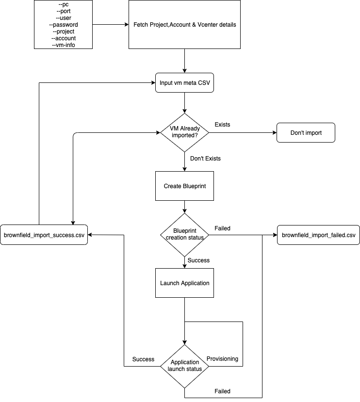

# Calm brownfield import of VMware VM's

Calm Brownfield import scripts help customer to do bulk import of existing VMware Vm's into CALM to do day2 operation like Stop/Start/VM Update/Snapshot/Restore/Clone with cloud like experience.

## Pre-requisites:
* Calm 2.9.x
* VCenter 6+


- `01_get_vmware_vm_info.py` Script takes VCenter host and Datacenter/Cluster information as a input and create vm metadata csv file, contents of file - (virutal_machine_name,virutal_machine_uuid,virtual_machine_ip,num_cpu,num_vcpus,memory_size,guest_family,host_uuid,datastore)
- `02_brownfield_import.py` Script takes the above csv as input and import the vm's into CALM as apps.

## Steps to install Install pyvmomi on centos 7.x:
```shell
sudo yum install -y python-pip
pip install --upgrade pip
pip install pyvmomi
```

## Inputs for 01_get_vmware_vm_info.py:
* --vcenterip - VCenter Host ip address
* --port - VCenter api port (Optional, Default=443)
* --user - VCenter Username
* --pass - Vcenter Password
* --clustername - VCenter Datacenter

## Steps to execute 01_get_vmware_vm_info.py:
```shell
python 01_get_vmware_vm_info.py -s <VCenter host ip> -u <VCenter username> -p <VCenter Password> -d <VCenter Cluster Name under datacenter>
```
* Above command gives a vm meta csv file <cluster name>.csv
* Next script takes vm meta csv file as input and imports the vm's in CALM.

## Steps to install Install requests on centos 7.x:
```shell
sudo yum install -y python-pip
pip install --upgrade pip
pip install requests
```

## Inputs for 02_brownfield_import.py:
* --pc - PC ip address
* --port - PC port (Optional, Default=9440)
* --user - PC username
* --pass - PC password
* --project - PC project name
* --account - VCenter Account name
* --vm-info - File path of <cluster name>.csv
* --parallel - Number of parallel executions (Optional, Default=5)



## Steps to execute 02_brownfield_import.py:
* Get linux template uuid and windows template uuid & Update in the script (not required post 2.9.7.1 upgrade) in 02_brownfield_import.py.
```shell
python 02_brownfield_import.py --pc <PC ip address> --user <PC Username> --pass <PC Password> --project <CALM project name> --account <CALM VMware account name> --vm-info /path/to/<cluster name>.csv
```
