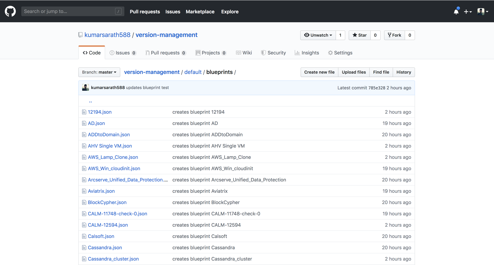

# Git Sync for Calm Blueprints.

## What does this do?
This scripts connects to your Nutanix Calm instance, iterates over the given list of projects, and for every project, looks at all blueprints in that project. If the blueprint is new, it uploads to git. If the blueprint is already present in git, it checks to see if the blueprint has changed/been updated. If changed, it uploads the new blueprint to git, else skip.
We recommend running this script as a cron job on an hourly/daily cadence to ensure all changes being made to your blueprints are regularly backed up.

Here is the demo video for how to sync calm blueprints to the git : [Git Sync Calm Blueprints](https://www.loom.com/share/0402693c4b114e48b4b979ee0a252e5c)

### To Dos:
* Backup task library
* Script to upload blueprints/task library items automatically into a blank calm instance

### Source Files
[git-sync-for-calm-blueprints.py](https://raw.githubusercontent.com/nutanix/blueprints/master/calm-integrations/git-sync-for-calm-blueprints/git-sync-for-calm-blueprints.py) script helps to upload blueprints to github repo.

[config.ini](https://raw.githubusercontent.com/nutanix/blueprints/master/calm-integrations/git-sync-for-calm-blueprints/config.ini) sample config file.

## Pre-Requisites
* Existing github account.
	* create a repository in the github account with directory structure given below (default and project1) are projects in calm.
```.
├── default
│   └── blueprints
│       └── README.md
└── project1
    └── blueprints
        └── README.md
```

* PC VM with calm enabled.
    * CALM v2.6+

## Setup
* Tested on Centos 8.0 & Python version 3.6.8

```mkdir ~/calm-git-upload && cd ~/calm-git-upload
virtualenv venv
source venv/bin/activate
pip install -r requirements.txt
```

## Generate config.ini
* Create config.ini file with git and calm endpoint details in the same directory as the script.

```
[calm]
pc_ip = <pc_ip>
pc_port = <pc_port>
username = <pc_username>
password = <pc_password>
project_list = <project1,project2>
[git]
owner = <git_owner>
repository = <git_repository>
username = <git_username>
password = <git_password>
```

## Start backup
```
# (optional) to disable InsecureRequestWarning from python requests
export PYTHONWARNINGS="ignore:Unverified HTTPS request"
# Activate virtual environment
source venv/bin/activate
python git-sync-for-calm-blueprints.py
```

## Sample Output:
```
(venv) skumar-blr-mbp:git-bp-upload sarat.kumar$ python git-sync-for-calm-blueprints.py
Fetching BP LabSessions details.
Updating BP LabSessions.
Fetching BP vm_cloudinit details.
Updating BP vm_cloudinit.
Fetching BP alphanos-aws details.
Updating BP alphanos-aws.
Fetching BP aplhanso details.
Updating BP aplhanso.
Fetching BP MSSQL AAG details.
Updating BP MSSQL AAG.
Fetching BP test123 details.
Creating BP test123.
Fetching BP testing_MVM details.
Creating BP testing_MVM.
Fetching BP vgvgv details.
Creating BP vgvgv.
Fetching BP sub_img details.
Creating BP sub_img.
Fetching BP singlevm_bp_withNIc details.
```


